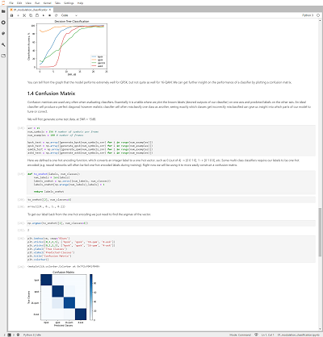
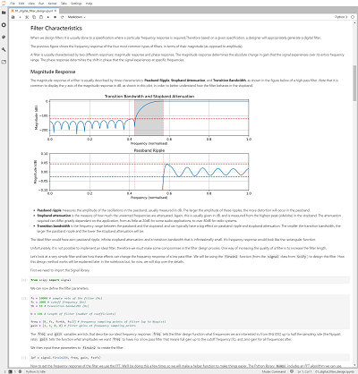
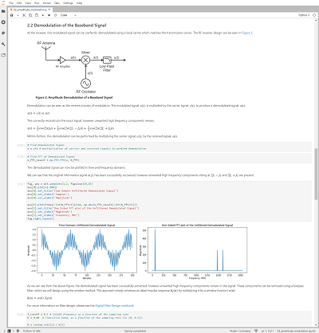
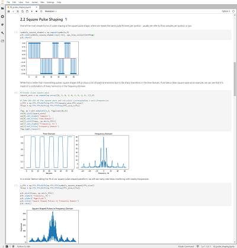
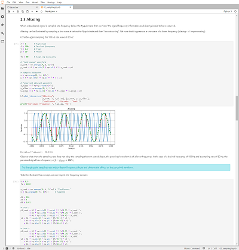
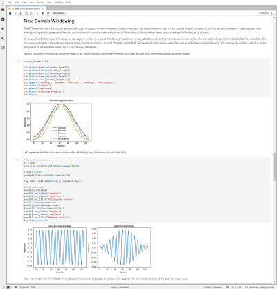

This repository has now been archived. See the new [RFSoC-Book](https://github.com/strath-sdr/RFSoC-Book/) repository that contains the same DSP Notebooks and more!

<table border="0" align="center">
    <tr border="0">
        <td align="center" width="50%" border="0">
            
        </td>
        <td align="center" width="50%" border="0">
            <font size=7><b>Available Now!</b></font size> <br> <font size=5>Software Defined Radio with Zynq® UltraScale+ RFSoC</font size> <br> <font size=4><a href="https://rfsocbook.com/">Free Download</a> <br><a href="https://www.amazon.com/Software-Defined-Radio-Ultrascale-RFSoC/dp/1739588606?keywords=zynq+rfsoc&qid=1673452844&sprefix=%2Caps%2C137&sr=8-1&linkCode=ll1&tag=thzybo-20&linkId=0bf245a543fd4af4625086df4c190928&language=en_US&ref_=as_li_ss_tl">Printed Edition</a></font size>
        </td>
    </tr>
</table>

# DSP Introductory Notebooks

This repository contains a collection of educational Jupyter Notebooks on DSP (Digital Signal Processing) theory. No special hardware required, just a computer that has Python and the Jupyter environment installed (we recommend [Anaconda](https://docs.anaconda.com/anaconda/install/) if you are setting up for the first time). If you are running this from a board running [PYNQ](https://github.com/Xilinx/PYNQ) you should already be all set.








## PYNQ Quick Start
The DSP notebooks can be installed on to your development board by running a simple line of code in a command terminal. **However, you will need to connect your board to the internet.** Follow the instructions below to install the notebooks now.
* Power on your development board with an SD Card containing a fresh PYNQ v2.7 image.
* Navigate to Jupyter Labs by opening a browser (preferably Chrome) and connecting to `http://<board_ip_address>:9090/lab`.
* We need to open a terminal in Jupyter Lab. Firstly, open a launcher window as shown in the figure below:

<p align="center">
  
<p/>

* Now open a terminal in Jupyter as illustrated below:

<p align="center">
  
<p/>

* Now simply run the code below that will install the package to your system.

```sh
pip3 install git+https://github.com/strath-sdr/dsp_notebooks
```

Once installation has complete you will find the DSP notebooks in the Jupyter workspace directory 'rfsoc-studio/dsp-notebooks'. The folder will be named 'dsp-notebooks'.
