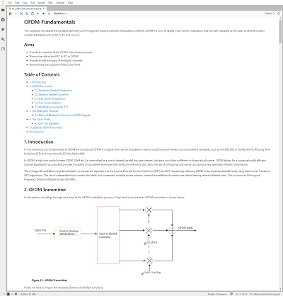
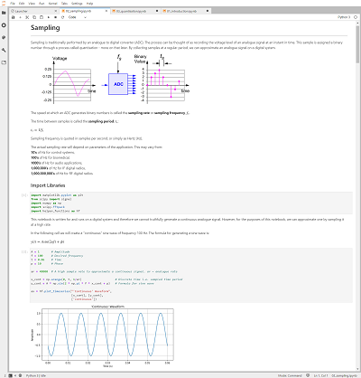

# DSP Introductory Notebooks

This repository contains a collection of educational Jupyter Notebooks on DSP (Digital Signal Processing) theory. No special hardware required, just a computer that has Python and the Jupyter environment installed (we recommend [Anaconda](https://docs.anaconda.com/anaconda/install/) if you are setting up for the first time). If you are running this from a board running [PYNQ](https://github.com/Xilinx/PYNQ) you should already be all set.

